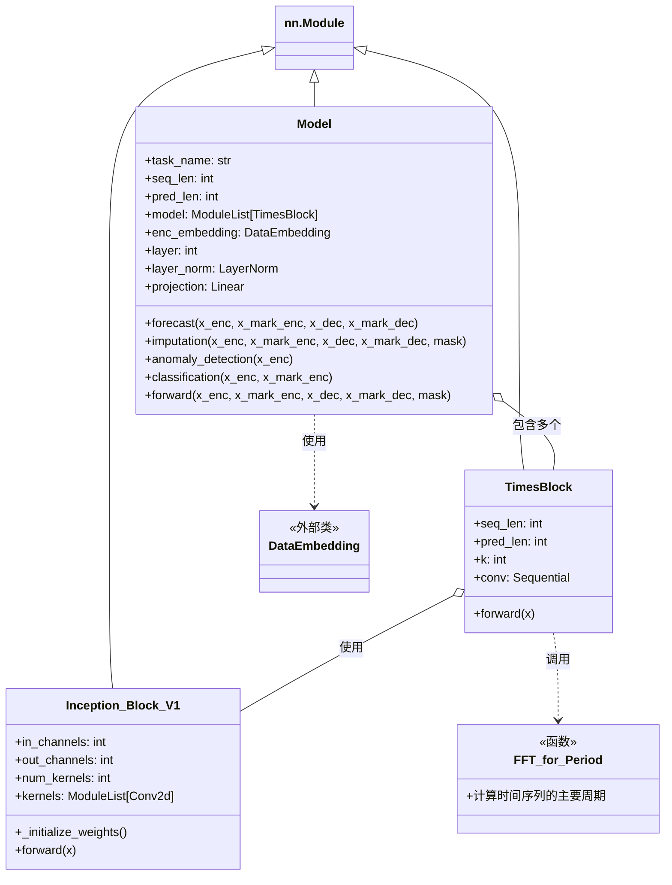

## Stack 增加维度复制

两处使用到咯

- `Inception_Block_V1` forward,stack 多尺度卷积,然后 mean 一下,恢复维度,也叫做特征融合

```python
def forward(self, x):
    res_list = []
    for i in range(self.num_kernels):
        res_list.append(self.kernels[i](x))
    res = torch.stack(res_list, dim=-1).mean(-1)
    return res
```

- TimesBlock stack  `5 个周期性尺度`   5 个周期性尺度的融合是 使用 `period_weight` 加权来的

```python
   else:
        length = (self.seq_len + self.pred_len)
        out = x
    # reshape
    out = out.reshape(B, length // period, period,
                      N).permute(0, 3, 1, 2).contiguous()
    # 2D conv: from 1d Variation to 2d Variation
    out = self.conv(out)
    # reshape back
    out = out.permute(0, 2, 3, 1).reshape(B, -1, N)
    res.append(out[:, :(self.seq_len + self.pred_len), :])
res = torch.stack(res, dim=-1)
# adaptive aggregation
period_weight = F.softmax(period_weight, dim=1)
period_weight = period_weight.unsqueeze(
    1).unsqueeze(1).repeat(1, T, N, 1)
res = torch.sum(res * period_weight, -1)
# residual connection
res = res + x
return res
```

## unsqueeze&repeat

两处用到

- ### TimesBlock forward

```python
res = torch.stack(res, dim=-1)
# adaptive aggregation
period_weight = F.softmax(period_weight, dim=1)
period_weight = period_weight.unsqueeze(1).unsqueeze(1).repeat(1, T, N, 1)
res = torch.sum(res * period_weight, -1)
```

len(res)=5,5种不同尺度的卷积,每个元素的形状  [32,36,512]

torch.stack  形状 [32,36,512,5]  5 个 [32,36,512]

一定要注意,研究对象换了 period_weight.shape=[32,5]

F.softmax 指数归一化权重 不懂,啥叫沿着 dim=1,whatever

->.unsqueeze(1)-> [32,1,5] ->.unsqueeze(1)-> [32,1,1,5]

`res * period_weight` 对两个形状相同的张量进行逐元素相乘[32,36,512,5] dim=-1, 变成 [32,36,512]

例子: 

#### TimesNet中周期权重的矩阵复制表示

我将使用矩阵表示法展示`period_weight`从初始形状到最终形状的变化过程。

##### 假设条件
- 批次大小 B = 2
- 时间步数 T = 3
- 特征维度 N = 2
- 周期数 k = 2

##### 初始矩阵
初始`period_weight`形状为[B, k] = [2, 2]：

$$
period\_weight = \begin{bmatrix}
[0.7 & 0.3] \\
[0.4 & 0.6]
\end{bmatrix}
$$

##### 第一次unsqueeze
`period_weight.unsqueeze(1)` → 形状变为[2, 1, 2]：
$$
period\_weight = \begin{bmatrix}
[[0.7 & 0.3]] \\
[[0.4 & 0.6]]
\end{bmatrix}
$$

##### 第二次unsqueeze
`period_weight.unsqueeze(1)` → 形状变为[2, 1, 1, 2]：

$$
period\_weight = \begin{bmatrix}
[[[0.7 & 0.3]]]\\
[[[0.4 & 0.6]]]
\end{bmatrix}
$$

##### repeat操作
`period_weight.repeat(1, 3, 2, 1)` → 形状变为[2, 3, 2, 2]：

```latex
[
  [[[0.7, 0.3],
      [0.7, 0.3]],
    [[0.7, 0.3],
      [0.7, 0.3]],
    [[0.7, 0.3],
      [0.7, 0.3]]],
  [[[0.4, 0.6],
      [0.4, 0.6]],
    [[0.4, 0.6],
     [0.4, 0.6]],
    [[0.4, 0.6],
    [0.4, 0.6]]]
]
```


##### 第一个批次(样本0)的权重矩阵:
$$
\begin{pmatrix}
\text{时间步0} \begin{pmatrix}
\text{特征0} & \begin{pmatrix} 0.7 & 0.3 \end{pmatrix} \\
\text{特征1} & \begin{pmatrix} 0.7 & 0.3 \end{pmatrix}
\end{pmatrix} \\
\text{时间步1} \begin{pmatrix}
\text{特征0} & \begin{pmatrix} 0.7 & 0.3 \end{pmatrix} \\
\text{特征1} & \begin{pmatrix} 0.7 & 0.3 \end{pmatrix}
\end{pmatrix} \\
\text{时间步2} \begin{pmatrix}
\text{特征0} & \begin{pmatrix} 0.7 & 0.3 \end{pmatrix} \\
\text{特征1} & \begin{pmatrix} 0.7 & 0.3 \end{pmatrix}
\end{pmatrix}
\end{pmatrix}
$$

##### 第二个批次(样本1)的权重矩阵:
$$
\begin{pmatrix}
\text{时间步0} \begin{pmatrix}
\text{特征0} & \begin{pmatrix} 0.4 & 0.6 \end{pmatrix} \\
\text{特征1} & \begin{pmatrix} 0.4 & 0.6 \end{pmatrix}
\end{pmatrix} \\
\text{时间步1} \begin{pmatrix}
\text{特征0} & \begin{pmatrix} 0.4 & 0.6 \end{pmatrix} \\
\text{特征1} & \begin{pmatrix} 0.4 & 0.6 \end{pmatrix}
\end{pmatrix} \\
\text{时间步2} \begin{pmatrix}
\text{特征0} & \begin{pmatrix} 0.4 & 0.6 \end{pmatrix} \\
\text{特征1} & \begin{pmatrix} 0.4 & 0.6 \end{pmatrix}
\end{pmatrix}
\end{pmatrix}
$$

##### 第一个批次(样本0)的完整矩阵：

$$
\begin{bmatrix} \text{时间步0:} & \begin{bmatrix} \text{特征0:} & [0.7, 0.3] \\ \text{特征1:} & [0.7, 0.3] \end{bmatrix} \\ \text{时间步1:} & \begin{bmatrix} \text{特征0:} & [0.7, 0.3] \\ \text{特征1:} & [0.7, 0.3] \end{bmatrix} \\ \text{时间步2:} & \begin{bmatrix} \text{特征0:} & [0.7, 0.3] \\ \text{特征1:} & [0.7, 0.3] \end{bmatrix} \end{bmatrix}
$$

##### 第二个批次(样本1)的完整矩阵：

$$
\begin{bmatrix} \text{时间步0:} & \begin{bmatrix} \text{特征0:} & [0.4, 0.6] \\ \text{特征1:} & [0.4, 0.6] \end{bmatrix} \\ \text{时间步1:} & \begin{bmatrix} \text{特征0:} & [0.4, 0.6] \\ \text{特征1:} & [0.4, 0.6] \end{bmatrix} \\ \text{时间步2:} & \begin{bmatrix} \text{特征0:} & [0.4, 0.6] \\ \text{特征1:} & [0.4, 0.6] \end{bmatrix} \end{bmatrix}
$$


##### 表格表示

更清晰的表格展示方式：

**批次0的period_weight**:

|         | 特征0      | 特征1      |
| ------- | ---------- | ---------- |
| 时间步0 | [0.7, 0.3] | [0.7, 0.3] |
| 时间步1 | [0.7, 0.3] | [0.7, 0.3] |
| 时间步2 | [0.7, 0.3] | [0.7, 0.3] |

**批次1的period_weight**:

|         | 特征0      | 特征1      |
| ------- | ---------- | ---------- |
| 时间步0 | [0.4, 0.6] | [0.4, 0.6] |
| 时间步1 | [0.4, 0.6] | [0.4, 0.6] |
| 时间步2 | [0.4, 0.6] | [0.4, 0.6] |

这种矩阵表示直观地展示了周期权重如何被复制到每个时间步和特征维度上，以便与`res`张量进行元素级乘法和聚合操作。

- ### TimesNet model forward

- x_enc [32,36,7]
- mean(1)  [32,1,7]
- stdev(dim=1) [32,1,7]
- enc_out  [32,36,512]
- `self.projection`   → dec_out [32,36,7]

```python
means = x_enc.mean(1, keepdim=True).detach() 
x_enc = x_enc - means
stdev = torch.sqrt(torch.var(x_enc, dim=1, keepdim=True, unbiased=False) + 1e-5)
x_enc /= stdev

# porject back
dec_out = self.projection(enc_out)

# De-Normalization from Non-stationary Transformer
dec_out = dec_out * (stdev[:, 0, :].unsqueeze(1).repeat(1, self.pred_len + self.seq_len, 1))
dec_out = dec_out + (means[:, 0, :].unsqueeze(1).repeat(1, self.pred_len + self.seq_len, 1))
return dec_out
```

- x_enc  [N,T,C] 这些 符号一个人一个用法,别管了,选个自己喜欢的吧

```python
dec_out = dec_out * (stdev[:, 0, :].unsqueeze(1).repeat(1, self.pred_len + self.seq_len, 1))
```

- stdev [32,1,7]
- `stdev[:, 0, :]` [32,7]  `.unsqueeze(1)`  [32,1,7] `.repeat(1, self.pred_len + self.seq_len, 1))`   
- 我的理解就是 把 7 复制了 36 步(pred+seq len)

**TimesNet中的标准差复制过程示例**

这行代码用于反归一化过程中，将每个批次的标准差复制到所有时间步。我将用具体例子解释：

**假设参数**

- 批次大小 B = 2
- 特征维度 C = 3
- self.pred_len = 4 (预测长度)
- self.seq_len = 2 (历史长度)

**初始标准差张量** 

`stdev`的形状为[B, 1, C] = [2, 1, 3]：
```
[
  [[0.1, 0.2, 0.3]],  # 第一个批次
  [[0.4, 0.5, 0.6]]   # 第二个批次
]
```

**步骤分解** 

🙂‍↕️1 `stdev[:, 0, :]` 

提取每个批次的第0个时间点的所有特征，形状变为[2, 3]：
```
[[0.1, 0.2, 0.3],  # 第一个批次
  [0.4, 0.5, 0.6]]   # 第二个批次
```

🙂‍↕️ 2.  `.unsqueeze(1)`

在时间维度增加一个轴，形状变为[2, 1, 3]：
```python
[
  [[0.1, 0.2, 0.3]],  # 第一个批次
  [[0.4, 0.5, 0.6]]   # 第二个批次
]
```

🙂‍↔️ 3. `.repeat(1, self.pred_len + self.seq_len, 1)`

在时间维度上复制6次(4+2)，形状变为[2, 6, 3]：
```python
[
  [
    [0.1, 0.2, 0.3],  # 时间步1
    [0.1, 0.2, 0.3],  # 时间步2
    [0.1, 0.2, 0.3],  # 时间步3
    [0.1, 0.2, 0.3],  # 时间步4
    [0.1, 0.2, 0.3],  # 时间步5
    [0.1, 0.2, 0.3]   # 时间步6
  ],
  [
    [0.4, 0.5, 0.6],  # 时间步1
    [0.4, 0.5, 0.6],  # 时间步2
    [0.4, 0.5, 0.6],  # 时间步3
    [0.4, 0.5, 0.6],  # 时间步4
    [0.4, 0.5, 0.6],  # 时间步5
    [0.4, 0.5, 0.6]   # 时间步6
  ]
]
```

有点明白了, 这里还是三维的比较好懂

## TimesNet 调用类图



- 这里的 mermaid 调用图,Hugo 不渲染,以后再说吧,[mermaid 在线渲染](https://mermaid-live.nodejs.cn/edit#pako:eNqdVeFr00AU_1fCfdowK2mzbl0Y--DmQNhE2PCDVsKZvLZnc3fd5eLW1X6QKfpBUEEtDEGEIUNhTBAZjuE_s67bf-ElabdrTUHNh8vL7733e793ebm0kMd9QA7yAhyGSwRXBaZlZqiLsdwq96MAjPnHU1OGsiHI9KwTCuH1gHv1TPdN5kFDEs7cJMa9k0_D0jWhNfgQjeEY3ZfPuq-_dvd2T4--pIGam2eyqqzTk1-9t_s6cS63YCxhiW_QB-D7hFVHotI1ab6f0Uqh-LomcVh3GabgGKEUmiOEDTcA5hiESQ1uCPCzcBozO0a6KysklPeuurmvxQHzXBgodYaFa2EBboIYrZGALuOCOsZKbN9S5pA2_hC8eMeUnzDAej8VLsDDoZzYcpUG09hyKRb1ge3DFaTsSS2R0EYkccz6V6mmQdWW6gSYcYqDpnLKVF3Ko4ckb4dUiDemzuRwI5tY-P8upv3nPGgT1_r_d18fBTzOHjnGGmxEwCTBQZb68aIy5l4XR5jr1TBjEISjdXkkx_pYRN06iCzXJaxN76JqoeDrk-sSRuJmyDa4m0CqNRlOTP5bZ8OfqdbU_Hx37_3Fzn7v2_HCwtj05eV1V1Vxb4Mg3B_Jf35y9u5wkJwIOj_41DvonHV-XHS-d3--6r7o9Hafnh4dn39-0n2zf_bhY0YhbSDic2WkomOcH-4kBwsyEQVBMfHVwZoIKSNZAwpl5CjThwqOAllGZdZWoTiSfK3JPORIEYGJBI-qNeRUcBCqp6jhYwn9g_kSbWB2l3M6SFGPyGmhLeQUrZw9XZqdKczadqlg5adN1ETOVGFmLlfK563CbN5WaNFum2g7Icjn7OJcwbLsYsmes0pWyUTgE8nFav-_EN9MVBVxM_3qApgPYpFHTCoCu_0b00sKbQ)

补充: 使用元数据控制 mermaid=true,可以避免所有页面无脑加载`Mermaid`, 只有启用了Mermaid的文章才会加载相应的脚本和样式

- 简单来说,就是

TimesNet(Model)调用 TimesBlock, TimesBlock调用 InceptionBlock

## embedding

```python
# embedding
enc_out = self.enc_embedding(x_enc, x_mark_enc)  # [B,T,C]
enc_out = self.predict_linear(enc_out.permute(0, 2, 1)).permute(0, 2, 1)  # align temporal dimension
```

还剩下最后的 embedding

### self.enc_embedding

```python
enc_out = self.enc_embedding(x_enc, x_mark_enc) 
```

x_enc = torch.Size([32, 12, 7])

x_mark_enc = torch.Size([32, 12, 4])

```python
DataEmbedding(
  (value_embedding): TokenEmbedding(
    (tokenConv): Conv1d(7, 512, kernel_size=(3,), stride=(1,), padding=(1,), bias=False, padding_mode=circular)
  )
  (position_embedding): PositionalEmbedding()
  (temporal_embedding): TimeFeatureEmbedding(
    (embed): Linear(in_features=4, out_features=512, bias=False)
  )
  (dropout): Dropout(p=0.1, inplace=False)
)
```

- x [32,12,7]→ self.value_embedding → [32,12,512]
- x_mark [32,12,4]→ self.temporal_embedding → [32,12,512]
- 上面的两个都是卷积层 , 没什么好说的
- x [32,12,7] → self.position_embedding(无训练参数) → 
- self.position_embedding = **PositionalEmbedding**(d_model=d_model)
- 只接收参数 512 , 这个位置编码的实现我也忘了

`self.position_embedding(x).shape` = `torch.Size([1, 12, 512])`

```python
class PositionalEmbedding(nn.Module):
    def __init__(self, d_model, max_len=5000):
        super(PositionalEmbedding, self).__init__()
        # Compute the positional encodings once in log space.
        pe = torch.zeros(max_len, d_model).float()
        pe.require_grad = False

        position = torch.arange(0, max_len).float().unsqueeze(1)
        div_term = (torch.arange(0, d_model, 2).float()
                    * -(math.log(10000.0) / d_model)).exp()

        pe[:, 0::2] = torch.sin(position * div_term)
        pe[:, 1::2] = torch.cos(position * div_term)

        pe = pe.unsqueeze(0)
        self.register_buffer('pe', pe)

    def forward(self, x):
        return self.pe[:, :x.size(1)]
```

这里 编码 行是最大长度,比如时间序列,就是每个时间步,列是每个时间步的特征

init 部分编码 pe 变量, forward 部分通过  通过 `:x.size(1)`  索引适合这里的部分  `pe = pe.unsqueeze(0)`  所以 pe 的 `shape=[1, 序列长度, d_model]`

`self.pe[:, :x.size(1)]`   的 shape []

- 虽然 self.pe 是三维数组,这里只给出两维的索引, 这里第三维没有指定，所以默认保留所有元素（特征维度）

- 关于这里的 tokenEmbedding  
- x = self.tokenConv(x.permute(0, 2, 1)).transpose(1, 2)
- 卷积卷的是中间维度,所以在进入卷积之前,这里是转置了维度,将时间步的特征维度 7 嵌入到 512,卷完了再转置回来

```python
enc_out = self.enc_embedding(x_enc, x_mark_enc)
```

好了,这句话执行完了,输出 shape=[32,12,512]

- 一个 tokenEmbedding 处理 x  7 嵌入到 512 维 用的卷积 7→512,时间步特征维度移到中间
- TemporalEmbedding 处理 x_mark 4 嵌入到 512 维 同样用的卷积 4→512,同样卷积卷的是 中间维度
- 位置编码,无参数,[1,maxLen,d_model] 然后索引需要的时间步长

好了,看下一句把

```python
enc_out = self.predict_linear(enc_out.permute(0, 2, 1)).permute(0, 2, 1)
```

enc_out.shape = [32,12,512]

permute [32,512,12]

```python
Linear(in_features=12, out_features=36, bias=True)
```

也就是 12 映射到 36 这个 36 可不是随便写的,这是 seqlen+predLen

- 线性层挪维度,是因为要处理最后一层
- 卷积层挪维度是因为处理 中间维度

`self.predict_linear` 的 init

```python
self.predict_linear = nn.Linear(
                self.seq_len, self.pred_len + self.seq_len)
```

- 这个确实 新奇了点

看点乱七八糟的原因吧,我最能接受的理由, 为了并行预测

> 一次性预测：这种设计使模型能够一次性预测整个未来序列 ,在最后只需提取预测部分：dec_out[:, -self.pred_len:, :]
>

---


1. 写在最后,这个模型初始化就很慢
2. print(model) 的打印模型结构不是按数据流动过程的
3. 看完了代码,接下来,回到论文
